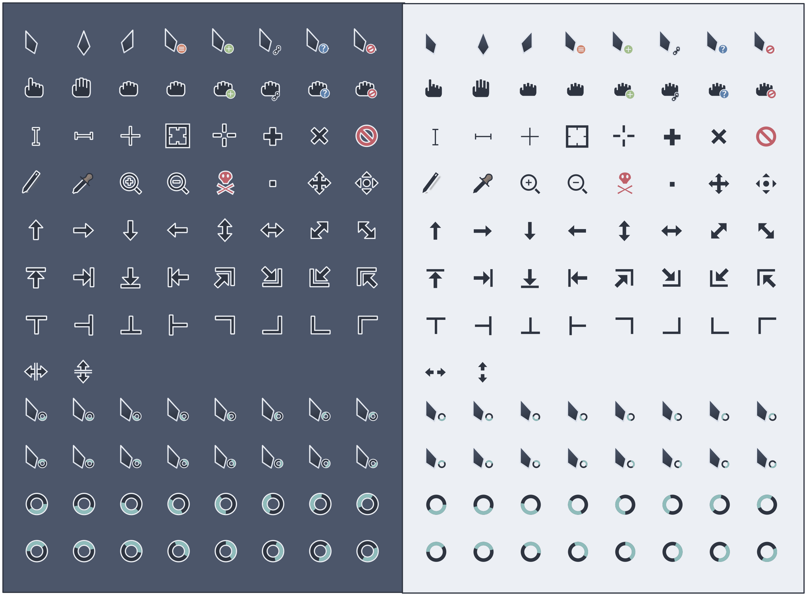
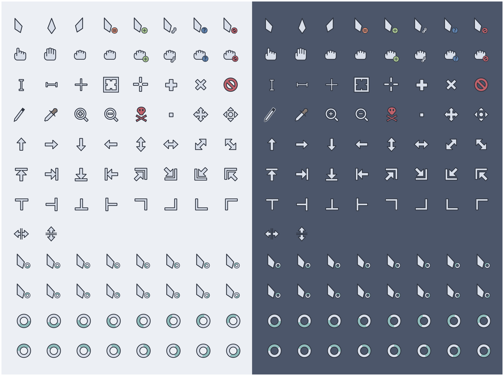

# Nordzy-Cursors




Cursor theme using the [Nord](https://github.com/arcticicestudio/nord) color palette and based on [Vimix](https://github.com/vinceliuice/Vimix-cursors) and [cz-Viator](https://github.com/charakterziffer/cursor-toolbox).

## Installation

### Installer
To use the installer, clone the repository and go inside it.
```
git clone https://github.com/alvatip/Nordzy-cursors
cd Nordzy-cursors
```
Then, run the installer script. For local installation, use
``` 
./install
```
And for system wide installation use:
``` 
sudo ./install
```
### tar.gz file
Alternatively, you can use the tar.gz files located in the archive folder of this directory and extract them to the adequate directory.
## Other ressources
[Nordzy](https://github.com/alvatip/Nordzy-icon) icon theme. </br> 
[Nordic](https://github.com/EliverLara/Nordic) GTK theme.
## License

GNU General Public License v3.0.


