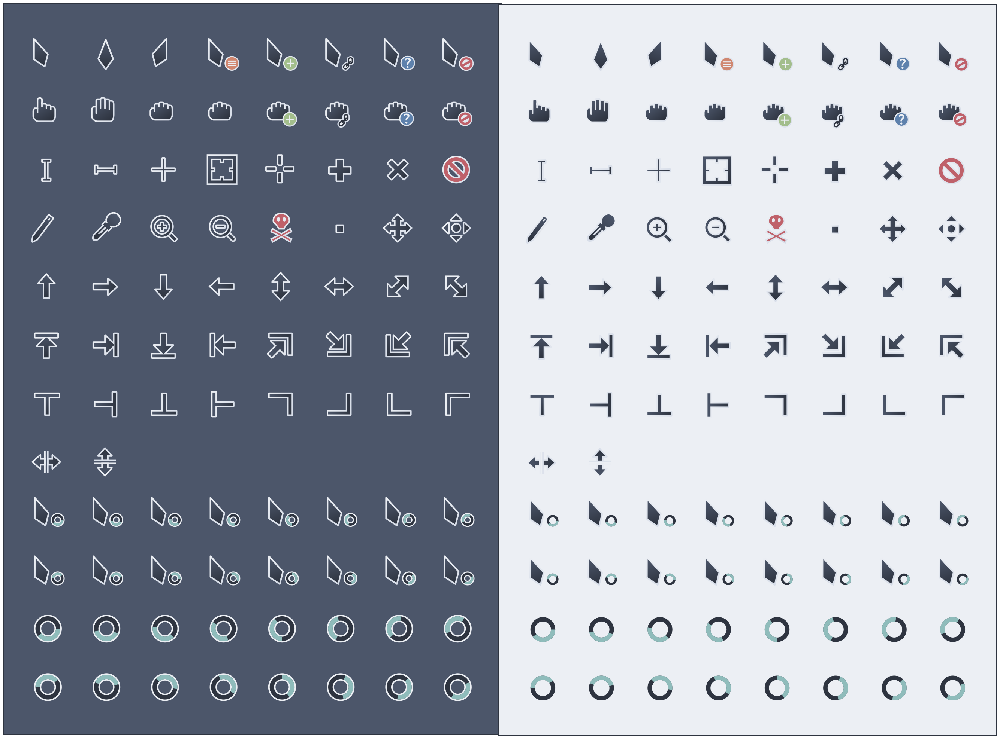

# Nordzy-Cursors
<p align="center">
	
</p>
<p align="center">
	 
	 
	
</p>

Cursor theme using the [Nord](https://github.com/arcticicestudio/nord) color palette and based on [Vimix](https://github.com/vinceliuice/Vimix-cursors) and [cz-Viator](https://github.com/charakterziffer/cursor-toolbox).

## Preview




## Installation

## Linux

### Installer
To use the installer, clone the repository and go inside it.
```
git clone https://github.com/alvatip/Nordzy-cursors
cd Nordzy-cursors
```
Then, run the installer script. For local installation, use
``` 
./install.sh
```
And for system wide installation use:
``` 
sudo ./install.sh
```
### tar.gz file
Alternatively, you can use the tar.gz files located in the archive folder or in the release section and extract them to the adequate directory.</br>
For local installation:
```
tar -zxvf Nordzy-cursors.tar.gz -C $HOME/.icons/
tar -zxvf Nordzy-cursors-white.tar.gz -C $HOME/.icons/
```
For system-wide installation: 
```
tar -zxvf Nordzy-cursors.tar.gz -C /usr/share/icons/
tar -zxvf Nordzy-cursors-white.tar.gz -C /usr/share/icons/
```

### Set the cursor theme
There are various way to set this (or another) cursor theme.</br>
You will find all the needed informations on this [ArchWiki](https://wiki.archlinux.org/title/Cursor_themes#GNOME)

### Uninstallation
If you installed it locally, run this command in your terminal: 
```
rm -r $HOME/.icons/Nordzy-cursors*
```
And if you installed it system-wide use:
```
sudo rm -r /usr/share/icons/Nordzy-cursors*
```
## Windows

To install the cursor theme on windows: 
1. Download "nordzy_cursors_windows.zip"
2. Extract the .zip file
3. In the folder, right click on the file "install.inf" and in the option choose "install"

## MacOs

To install the cursor theme on MacOs: 
1. Install [Mousecape](https://github.com/alexzielenski/Mousecape/releases)
2. Download and extract the Nordzy.cape.zip
3. With Mousecape installed on your system, double click the extracted .cape file to import it automatically in Mousecape
4. Then, make the Nordzy cape active in Mousecape

If you need any further information on how Mousecape works or if you have issues with it, please refer to the [project](https://github.com/alexzielenski/Mousecape) page and open an [issue](https://github.com/alexzielenski/Mousecape/issues) if needed.

## Also available on Pling
<p align="left">
  <a href="https://www.pling.com/p/1571937/" >
    
  </a>
</p>

## Other ressources
[Nordzy](https://github.com/alvatip/Nordzy-icon) icon theme. </br> 
[Nordic](https://github.com/EliverLara/Nordic) GTK theme.

##  Issues

If you have any issues, report them [here](https://github.com/alvatip/Nordzy-cursors/issues), I will be happy to help you!

##  How can I help ?

* By giving a **star** or **follow** on GitHub.
* By **rating** it on [Pling](https://www.pling.com/p/1571937/)
* By participating to the project, creating PR, making suggestion, ...

## Licence

GNU General Public Licence v3.0.


